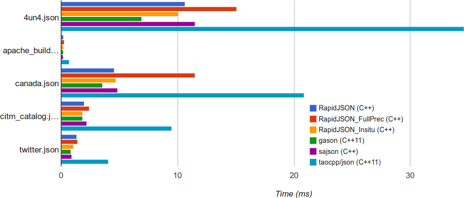
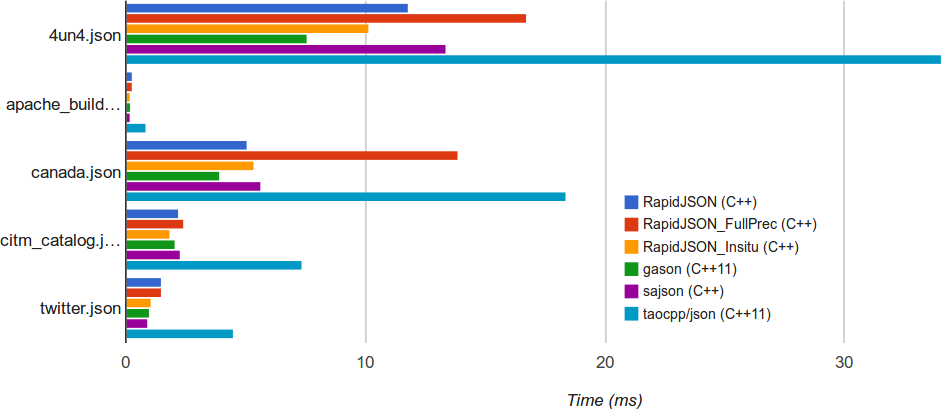
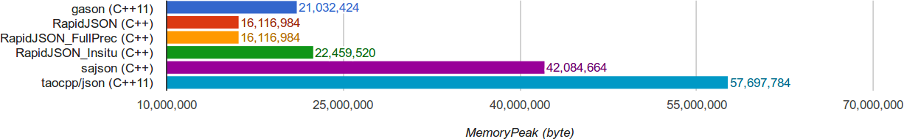

# Which of the C++ JSON parsers is the fastest one for your JSON files?

I got curious because different benchmarks show different results.
So, which of the DOM-building parsers can be the fastest one as of August 2017?

* [**RapidJSON**](http://rapidjson.org/) by Milo Yip.
  It is a well-known fastest C++ parser.
  When there is a news on r/rust that a [library in Rust is faster][3]
  than the fastest C++ JSON library -- they mean RapidJSON.
  RapidJSON may also be the most flexible one. It has full-precision mode
  for slow but pedantic parsing of numbers, in-situ mode for fast
  parsing that modifies the input buffer (like sajson and gason), and so on.

* [**sajson**](https://github.com/chadaustin/sajson) by Chad Austin.
  I learnt about it from the author's [recent blog post][1].
  Interesting read. Recently sajson got a boost by borrowing a few tricks
  from Rich Geldreich's [pjson](https://pastebin.com/hnhSTL3h).
  After this boost sajson is faster than RapidJSON, but still not as fast
  as pjson.
  Unfortunately, pjson itself was just dumped into pastebin
  with no intention to maintain it.

* [**gason**](https://github.com/vivkin/gason) by Ivan Vashchaev.
  It is a tiny library, only about 450 LOC.
  Benchmarks from the project's page show performance similar to RapidJSON.
  Unlike other parsers listed here gason simplifies numeric parsing by
  having only a single numeric type (integers are stored as `double`).

  Apparently, in the last years the author has been working on
  [gason2](https://github.com/vivkin/jzon) which aims to be both faster
  and more accurate in number parsing.
  But it is not clear to me what is the current status of gason2.

I'll skip [Jsmn](https://github.com/zserge/jsmn) by Serge Zaitsev,
"world fastest JSON parser/tokenizer" which indeed wins in one of
the RapidJSON's benchmarks ([Statistics][2]),
because it doesn't create a DOM-like structure.

On the other hand I'll include
[**taocpp/json**](https://github.com/taocpp/json) (by Daniel Frey and
Colin Hirsch), which doesn't aim to be that fast. On the contrary,
it uses standards C++ containers, avoids manual optimisations (actually,
the parser is "generated" by the excellent PEGTL library), and is as
correct as possible. Despite of this it has a decent performance.

I'm including taocpp as a baseline, because it is a neat
project that I may use at some point -- if not for JSON then
for CBOR (good alternative to MessagePack and UBJSON).
Unlike most of the other JSON parsers taocpp has bus factor 2 not 1.

---

The easiest way to compare the parsers is to run RapidJSON's
[nativejson-benchmark](https://github.com/miloyip/nativejson-benchmark)
with own data files.

## nativejson-benchmark

This benchmark has an impressive collection of more than 40 C and C++ parsers.
It does not have pjson and gason2 (it has a pjson but a different one),
and I won't bother with adding them, although they could be the fastest ones.

To run it, you need premake5 for build and php for report generation.
And more than 0.5 GB of the disk space for cloning all the tested parsers.

### Pick data files

To change the data files used in the benchmark just drop your files
into the `data/` directory and edit `data/data.txt`.

I'm here to benchmark parsing of [mmJSON](https://pdbj.org/help/mmjson) files.
As an example I'll use
[4un4](http://www.rcsb.org/pdb/explore.do?structureId=4un4)
converted from mmCIF to mmJSON with gemmi-convert.

And I'll also add `apache_builds.min.json` from sajson benchmark --
to check if I get the same result (sajson faster than RapidJSON).

    jq -c . <thirdparty/sajson/testdata/apache_builds.json >data/apache_builds.min.json

### Pick parsers

Maintaining a code that includes 40+ third-party libraries is an ungrateful
task and as can be seen from the project issues, it is not easy to compile.
But it will be quite easy if you want to check only a few libraries:
just remove most of the files from `src/tests/` leaving only
tests for selected parsers (gasontest.cpp, rapidjsonfullprectest.cpp,
rapidjsoninsitutest.cpp, rapidjsontest.cpp, sajsontest.cpp, taocpptest.cpp).

You may also want to comment out building of problematic static libraries
in `build/premake5.lua` (they are built for individual parsers).

I also updated each of the tested parsers in `thirdparty/`
to its latest version, just to be sure.

### Pick compilers and options

To use GCC 5 just do:

    CXX=g++-5 CC=gcc-5 PATH="path/to/premake5/dir:$PATH" make

Unfortunately, the benchmark doesn't build with GCC 7 and Clang 4.
As a workaround I disabled memory statistic (`USE_MEMORYSTAT`),
which in turn confused the report generator. So I got full reports
for GCC 5 and somewhat broken reports for GCC 7 and Clang 4.
Anyway, it's awesome that that the benchmark generates reports with plots
in addition to printing the numbers.

Compilation options can be changed in `build/premake5.lua`.

## Conformance reports

Nativejson-benchmark produces also a *conformance report* for each parser.
The simplest parsers, such as gason, get a
[poor score](https://rawgit.com/miloyip/nativejson-benchmark/master/sample/conformance.html).
But looking closely at it the failing conformance tests are not necessarily
bad things.

The first category has strictness tests. Gason and many others are
intentionally more liberal in accepting input than the JSON standard.
This may actually be a good thing.

Then, numerical accuracy. For example, gason stores 1.234e-10
as 1.2340000000000014e-10 instead of 1.2340000000000001e-10.
A trade-off between speed and accuracy.

Finally, gason does not handle correctly the null byte (`\0`) in the middle
of a string, and fails to translate `\u` surrogate pairs into UTF-8.
This is good to know, even if it is not relevant to my input files.

Sajson and RapidJSON without the full-precision mode fail only on the
numerical tests. Taocpp/json and RapidJSON-full-prec are 100% conformant.

## Results

I ran the tests on Ubuntu 16.04 on a laptop with Intel Broadwell processor.
By default, the benchmark is compiled with `-O3 -march=native`.
I tested it also without `-march=native`, but the results were
approximately the same. Both sets of results are in
[this](https://rawgit.com/project-gemmi/benchmarking-json/master/result-native/performance_Corei7-5600U@2.60GHz_linux64_gcc5.4.html)
[repo](https://rawgit.com/project-gemmi/benchmarking-json/master/result-generic/performance_Corei7-5600U@2.60GHz_linux64_gcc5.4.html).

Here is what I got with GCC 7:

(Yes, it'd be better to show MB/s).

Three of the benchmarks are in-situ: RapidJSON_Insitu, sajson, gason.
Two are not in-situ and with full numeric precision:
taocpp and RapidJSON_FullPrec.

The results are consistent with both gason and sajson benchmarks.
Each of RapidJSON, sajson and gason wins at least one test and can be
rightfully called the fastest parser.

As Chad [noted in #1](https://github.com/project-gemmi/benchmarking-json/issues/1),
sajson in the dynamic allocation mode (that was used here) trades
a bit of CPU performance for much lower peak memory usage when parsing.

Here are results I got with Clang 4:

[Chad's results][1] were showing very low performance of rapidjson/clang
(the graph for Ubuntu 16.04 on Intel Broadwell). Here Clang is almost
as good as GCC.

And if you wonder about memory usage:

Note that benchmarks of the in-situ parsers first copy the original data,
so if you already have a mutable buffer with the data
it is gason that will have the smallest memory footprint.

Finally, parsing is only part of the job and one should also benchmark access
to the resulting data structure. But this would require more work...

[1]: https://chadaustin.me/2017/05/writing-a-really-really-fast-json-parser/
[2]: https://rawgit.com/miloyip/nativejson-benchmark/master/sample/performance_Corei7-4980HQ@2.80GHz_mac64_clang7.0.html#4.%20Statistics
[3]: https://www.reddit.com/r/rust/comments/6albr0/serde_compared_to_the_fastest_c_json_library/
